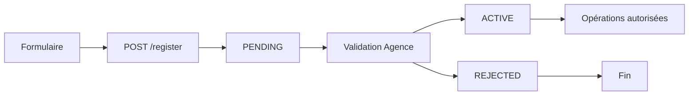

# 📱 UserService - Documentation API Complète

## 🎯 Vue d'ensemble

**UserService** est un microservice de gestion des clients pour un système bancaire camerounais. Il gère l'enregistrement, l'authentification, les opérations financières et la communication avec d'autres services via RabbitMQ.

### 🏗️ Architecture

```
Frontend → UserService (REST API) → RabbitMQ → [AgenceService, TransactionService, NotificationService]
```

### 🔧 Technologies
- **Framework** : Spring Boot 3.x
- **Base de données** : MongoDB
- **Messaging** : RabbitMQ
- **Sécurité** : Spring Security + JWT
- **Documentation** : OpenAPI/Swagger

---

## 🚀 Configuration et Démarrage

### Prérequis
```yaml
# application.yml
spring:
  data:
    mongodb:
      uri: mongodb://localhost:27017/userservice
      
  rabbitmq:
    host: localhost
    port: 5672
    username: guest
    password: guest
    
server:
  port: 8081
```

### URL Base
```
http://localhost:8081/api/v1/users
```

---

## 📋 Endpoints API

### 🔐 Authentification (Endpoints Publics)

#### 1. Enregistrement d'un nouveau client
```http
POST /api/v1/users/register
Content-Type: application/json
```

**Body :**
```json
{
  "cni": "123456789",
  "email": "jean.dupont@example.com",
  "nom": "DUPONT",
  "prenom": "Jean",
  "numero": "654123456",
  "password": "Password123!",
  "idAgence": "AGENCE001",
  "rectoCni": "base64_image",
  "versoCni": "base64_image"
}
```

**Réponse :**
```json
{
  "status": "PENDING",
  "message": "Votre demande a été transmise et sera traitée dans les plus brefs délais",
  "requestId": "uuid-generated",
  "timestamp": "2025-06-05T10:30:00"
}
```

**Codes de statut :**
- `202` : Demande acceptée
- `400` : Données invalides
- `409` : Email/CNI/Numéro déjà existant

#### 2. Vérification du statut d'enregistrement
```http
GET /api/v1/users/registration-status?email=jean.dupont@example.com
```

**Réponse :**
```json
{
  "status": "ACTIVE",
  "message": "Votre compte est actif",
  "createdAt": "2025-06-05T08:00:00"
}
```

**Statuts possibles :**
- `PENDING` : En attente de validation
- `ACTIVE` : Compte actif
- `REJECTED` : Demande rejetée
- `BLOCKED` : Compte bloqué
- `NOT_FOUND` : Aucune demande trouvée

#### 3. Demande de réinitialisation mot de passe
```http
POST /api/v1/users/password-reset/request
Content-Type: application/json
```

**Body :**
```json
{
  "cni": "123456789",
  "email": "jean.dupont@example.com",
  "numero": "654123456",
  "nom": "DUPONT"
}
```

---

### 💰 Opérations Financières (Authentification requise)

> **🔒 Authentification** : Header `Authorization: Bearer <jwt_token>` requis

#### 1. Effectuer un dépôt
```http
POST /api/v1/users/deposit
Authorization: Bearer <jwt_token>
Content-Type: application/json
```

**Body :**
```json
{
  "montant": 50000,
  "numeroClient": "client-123",
  "numeroCompte": 123456789
}
```

**Réponse :**
```json
{
  "transactionId": "txn-uuid",
  "status": "SUCCESS",
  "message": "Dépôt réussi",
  "montant": 50000,
  "timestamp": "2025-06-05T14:30:00"
}
```

**Limites :**
- Minimum : 100 FCFA
- Maximum : 10,000,000 FCFA

#### 2. Effectuer un retrait
```http
POST /api/v1/users/withdrawal
Authorization: Bearer <jwt_token>
Content-Type: application/json
```

**Body :**
```json
{
  "montant": 25000,
  "numeroClient": "client-123",
  "numeroCompte": 123456789
}
```

**Limites :**
- Minimum : 100 FCFA
- Maximum : 5,000,000 FCFA

#### 3. Effectuer un transfert
```http
POST /api/v1/users/transfer
Authorization: Bearer <jwt_token>
Content-Type: application/json
```

**Body :**
```json
{
  "montant": 15000,
  "numeroCompteSend": 123456789,
  "numeroCompteReceive": 987654321
}
```

---

### 👤 Gestion du Profil (Authentification requise)

#### 1. Récupérer le profil utilisateur
```http
GET /api/v1/users/profile
Authorization: Bearer <jwt_token>
```

**Réponse :**
```json
{
  "idClient": "client-123",
  "nom": "DUPONT",
  "prenom": "Jean",
  "email": "jean.dupont@example.com",
  "numero": "654123456",
  "status": "ACTIVE",
  "createdAt": "2025-05-01T10:00:00",
  "lastLogin": "2025-06-05T09:30:00"
}
```

#### 2. Mettre à jour le profil
```http
PUT /api/v1/users/profile/{clientId}
Content-Type: application/json
```

**Body :**
```json
{
  "email": "nouveau.email@example.com",
  "numero": "654987654",
  "nom": "MARTIN",
  "prenom": "Pierre"
}
```

---

### 🔍 Endpoints Administratifs

#### 1. Rechercher des clients
```http
GET /api/v1/users/search?searchTerm=DUPONT&page=0&size=20
Authorization: Bearer <admin_token>
```

**Réponse :**
```json
[
  {
    "idClient": "client-123",
    "nom": "DUPONT",
    "prenom": "Jean",
    "email": "jean.dupont@example.com",
    "status": "ACTIVE"
  }
]
```

#### 2. Statistiques clients
```http
GET /api/v1/users/statistics
Authorization: Bearer <admin_token>
```

**Réponse :**
```json
{
  "totalClients": 1250,
  "activeClients": 980,
  "pendingClients": 150,
  "blockedClients": 20,
  "newClientsToday": 15,
  "generatedAt": "2025-06-05T15:00:00"
}
```

---

## 🔧 Intégration Frontend

### 1. Configuration de base

```javascript
// Configuration API
const API_BASE_URL = 'http://localhost:8081/api/v1/users';
const AUTH_TOKEN = localStorage.getItem('authToken');

// Headers par défaut
const defaultHeaders = {
  'Content-Type': 'application/json',
  'Authorization': `Bearer ${AUTH_TOKEN}`
};
```

### 2. Service d'enregistrement

```javascript
class UserRegistrationService {
  
  // Enregistrer un nouveau client
  async registerClient(userData) {
    try {
      const response = await fetch(`${API_BASE_URL}/register`, {
        method: 'POST',
        headers: { 'Content-Type': 'application/json' },
        body: JSON.stringify(userData)
      });
      
      const result = await response.json();
      
      if (response.status === 202) {
        return { success: true, data: result };
      } else {
        return { success: false, error: result.message };
      }
    } catch (error) {
      return { success: false, error: 'Erreur de connexion' };
    }
  }
  
  // Vérifier le statut d'enregistrement
  async checkStatus(email) {
    try {
      const response = await fetch(`${API_BASE_URL}/registration-status?email=${email}`);
      const result = await response.json();
      
      return {
        success: response.ok,
        status: result.status,
        message: result.message
      };
    } catch (error) {
      return { success: false, error: 'Erreur de vérification' };
    }
  }
}
```

### 3. Service des opérations financières

```javascript
class FinancialService {
  
  // Effectuer un dépôt
  async deposit(amount, accountNumber) {
    try {
      const response = await fetch(`${API_BASE_URL}/deposit`, {
        method: 'POST',
        headers: defaultHeaders,
        body: JSON.stringify({
          montant: amount,
          numeroClient: this.getCurrentClientId(),
          numeroCompte: accountNumber
        })
      });
      
      const result = await response.json();
      
      return {
        success: response.ok,
        transaction: result
      };
    } catch (error) {
      return { success: false, error: 'Erreur lors du dépôt' };
    }
  }
  
  // Effectuer un retrait
  async withdraw(amount, accountNumber) {
    // Similaire au dépôt avec endpoint /withdrawal
  }
  
  // Effectuer un transfert
  async transfer(amount, fromAccount, toAccount) {
    try {
      const response = await fetch(`${API_BASE_URL}/transfer`, {
        method: 'POST',
        headers: defaultHeaders,
        body: JSON.stringify({
          montant: amount,
          numeroCompteSend: fromAccount,
          numeroCompteReceive: toAccount
        })
      });
      
      return await response.json();
    } catch (error) {
      return { success: false, error: 'Erreur lors du transfert' };
    }
  }
}
```

### 4. Service de gestion du profil

```javascript
class ProfileService {
  
  // Récupérer le profil
  async getProfile() {
    try {
      const response = await fetch(`${API_BASE_URL}/profile`, {
        headers: defaultHeaders
      });
      
      if (response.ok) {
        return await response.json();
      } else {
        throw new Error('Profil non trouvé');
      }
    } catch (error) {
      throw new Error('Erreur lors de la récupération du profil');
    }
  }
  
  // Mettre à jour le profil
  async updateProfile(clientId, updates) {
    try {
      const response = await fetch(`${API_BASE_URL}/profile/${clientId}`, {
        method: 'PUT',
        headers: defaultHeaders,
        body: JSON.stringify(updates)
      });
      
      return {
        success: response.ok,
        data: await response.json()
      };
    } catch (error) {
      return { success: false, error: 'Erreur de mise à jour' };
    }
  }
}
```

---

## 🔔 Gestion des Erreurs

### Codes d'erreur courants

| Code | Signification | Action Frontend |
|------|---------------|------------------|
| 400 | Données invalides | Afficher erreurs de validation |
| 401 | Non authentifié | Rediriger vers login |
| 403 | Accès refusé | Afficher message d'autorisation |
| 404 | Ressource non trouvée | Afficher message "non trouvé" |
| 409 | Conflit (données existantes) | Demander modification |
| 503 | Service indisponible | Réessayer plus tard |

### Exemple de gestion d'erreurs

```javascript
class ErrorHandler {
  static handle(response, error) {
    switch (response?.status) {
      case 400:
        return this.handleValidationError(error);
      case 401:
        return this.handleAuthError();
      case 503:
        return this.handleServiceUnavailable();
      default:
        return 'Une erreur inattendue s\'est produite';
    }
  }
  
  static handleValidationError(error) {
    if (error.fieldErrors) {
      return Object.entries(error.fieldErrors)
        .map(([field, message]) => `${field}: ${message}`)
        .join('\n');
    }
    return error.message || 'Données invalides';
  }
  
  static handleAuthError() {
    localStorage.removeItem('authToken');
    window.location.href = '/login';
    return 'Session expirée, veuillez vous reconnecter';
  }
  
  static handleServiceUnavailable() {
    return 'Service temporairement indisponible, veuillez réessayer';
  }
}
```

---

## 📱 Exemples d'interface utilisateur

### Formulaire d'enregistrement

```javascript
// Composant React d'exemple
function RegistrationForm() {
  const [formData, setFormData] = useState({
    cni: '',
    email: '',
    nom: '',
    prenom: '',
    numero: '',
    password: '',
    idAgence: 'AGENCE001'
  });
  
  const handleSubmit = async (e) => {
    e.preventDefault();
    
    const service = new UserRegistrationService();
    const result = await service.registerClient(formData);
    
    if (result.success) {
      alert('Demande envoyée avec succès !');
      // Rediriger vers page de vérification
    } else {
      alert(`Erreur: ${result.error}`);
    }
  };
  
  return (
    <form onSubmit={handleSubmit}>
      <input 
        type="text" 
        placeholder="CNI" 
        value={formData.cni}
        onChange={(e) => setFormData({...formData, cni: e.target.value})}
        pattern="\\d{8,12}"
        required 
      />
      <input 
        type="email" 
        placeholder="Email" 
        value={formData.email}
        onChange={(e) => setFormData({...formData, email: e.target.value})}
        required 
      />
      <input 
        type="tel" 
        placeholder="Numéro (6XXXXXXXX)" 
        value={formData.numero}
        onChange={(e) => setFormData({...formData, numero: e.target.value})}
        pattern="^6[5-9]\\d{7}$"
        required 
      />
      <input 
        type="password" 
        placeholder="Mot de passe" 
        value={formData.password}
        onChange={(e) => setFormData({...formData, password: e.target.value})}
        pattern="^(?=.*[a-z])(?=.*[A-Z])(?=.*\\d)(?=.*[@$!%*?&])[A-Za-z\\d@$!%*?&].*$"
        minLength="8"
        required 
      />
      <button type="submit">S'inscrire</button>
    </form>
  );
}
```

### Interface de transaction

```javascript
function TransactionPanel() {
  const [amount, setAmount] = useState('');
  const [accountNumber, setAccountNumber] = useState('');
  const [loading, setLoading] = useState(false);
  
  const handleDeposit = async () => {
    setLoading(true);
    
    const service = new FinancialService();
    const result = await service.deposit(parseFloat(amount), parseInt(accountNumber));
    
    if (result.success) {
      alert(`Dépôt réussi ! ID: ${result.transaction.transactionId}`);
      setAmount('');
      setAccountNumber('');
    } else {
      alert(`Erreur: ${result.error}`);
    }
    
    setLoading(false);
  };
  
  return (
    <div className="transaction-panel">
      <h3>Effectuer un dépôt</h3>
      <input 
        type="number" 
        placeholder="Montant (FCFA)" 
        value={amount}
        onChange={(e) => setAmount(e.target.value)}
        min="100"
        max="10000000"
      />
      <input 
        type="number" 
        placeholder="Numéro de compte" 
        value={accountNumber}
        onChange={(e) => setAccountNumber(e.target.value)}
      />
      <button 
        onClick={handleDeposit} 
        disabled={loading || !amount || !accountNumber}
      >
        {loading ? 'En cours...' : 'Déposer'}
      </button>
    </div>
  );
}
```

---

## 🚨 Validation côté Frontend

### Règles de validation importantes

```javascript
const ValidationRules = {
  cni: {
    pattern: /^\d{8,12}$/,
    message: 'CNI doit contenir 8 à 12 chiffres'
  },
  
  numeroTelephone: {
    pattern: /^6[5-9]\d{7}$/,
    message: 'Numéro camerounais requis (6XXXXXXXX)'
  },
  
  motDePasse: {
    pattern: /^(?=.*[a-z])(?=.*[A-Z])(?=.*\d)(?=.*[@$!%*?&])[A-Za-z\d@$!%*?&].*$/,
    minLength: 8,
    message: 'Mot de passe doit contenir: majuscule, minuscule, chiffre, caractère spécial'
  },
  
  montant: {
    min: 100,
    maxDeposit: 10000000,
    maxWithdrawal: 5000000,
    message: 'Montant hors limites autorisées'
  }
};

// Fonction de validation
function validateField(field, value, rule) {
  if (rule.pattern && !rule.pattern.test(value)) {
    return rule.message;
  }
  
  if (rule.minLength && value.length < rule.minLength) {
    return `Minimum ${rule.minLength} caractères requis`;
  }
  
  const numValue = parseFloat(value);
  if (rule.min && numValue < rule.min) {
    return `Minimum ${rule.min} FCFA`;
  }
  
  if (rule.max && numValue > rule.max) {
    return `Maximum ${rule.max} FCFA`;
  }
  
  return null; // Valide
}
```

---

## 🔄 États et Flux de Données

### Cycle de vie d'un client



### États des transactions

```javascript
const TransactionStates = {
  PENDING: 'En cours de traitement',
  SUCCESS: 'Transaction réussie',
  FAILED: 'Transaction échouée',
  REJECTED: 'Transaction rejetée',
  TIMEOUT: 'Délai dépassé'
};
```

---

## 🛡️ Sécurité Frontend

### Stockage sécurisé des tokens

```javascript
class TokenManager {
  static setToken(token) {
    // Utiliser httpOnly cookies en production
    localStorage.setItem('authToken', token);
    this.scheduleRefresh(token);
  }
  
  static getToken() {
    return localStorage.getItem('authToken');
  }
  
  static removeToken() {
    localStorage.removeItem('authToken');
  }
  
  static isTokenValid() {
    const token = this.getToken();
    if (!token) return false;
    
    try {
      const payload = JSON.parse(atob(token.split('.')[1]));
      return payload.exp > Date.now() / 1000;
    } catch {
      return false;
    }
  }
  
  static scheduleRefresh(token) {
    // Programmer le renouvellement du token
    const payload = JSON.parse(atob(token.split('.')[1]));
    const timeToRefresh = (payload.exp - 300) * 1000 - Date.now(); // 5 min avant expiration
    
    setTimeout(() => {
      this.refreshToken();
    }, timeToRefresh);
  }
}
```

---

## 📊 Monitoring et Logs

### Suivi des opérations

```javascript
class OperationLogger {
  static log(operation, data, result) {
    const logEntry = {
      operation,
      timestamp: new Date().toISOString(),
      data: this.sanitizeData(data),
      result: result.success ? 'SUCCESS' : 'ERROR',
      error: result.error || null
    };
    
    // Envoyer vers service de monitoring
    this.sendToMonitoring(logEntry);
  }
  
  static sanitizeData(data) {
    // Supprimer les données sensibles
    const sanitized = { ...data };
    delete sanitized.password;
    delete sanitized.cni;
    return sanitized;
  }
}
```

---

## 🎨 Conseils d'implémentation

### 1. **Gestion d'état globale**
```javascript
// Context React pour l'état utilisateur
const UserContext = createContext();

export function UserProvider({ children }) {
  const [user, setUser] = useState(null);
  const [loading, setLoading] = useState(true);
  
  useEffect(() => {
    // Vérifier le token au démarrage
    if (TokenManager.isTokenValid()) {
      loadUserProfile();
    } else {
      setLoading(false);
    }
  }, []);
  
  return (
    <UserContext.Provider value={{ user, setUser, loading }}>
      {children}
    </UserContext.Provider>
  );
}
```

### 2. **Composants réutilisables**
```javascript
// Composant de montant avec validation
function AmountInput({ value, onChange, maxAmount, label }) {
  const [error, setError] = useState('');
  
  const handleChange = (e) => {
    const amount = parseFloat(e.target.value);
    
    if (amount < 100) {
      setError('Montant minimum 100 FCFA');
    } else if (amount > maxAmount) {
      setError(`Montant maximum ${maxAmount.toLocaleString()} FCFA`);
    } else {
      setError('');
    }
    
    onChange(e.target.value);
  };
  
  return (
    <div className="amount-input">
      <label>{label}</label>
      <input 
        type="number" 
        value={value}
        onChange={handleChange}
        min="100"
        max={maxAmount}
      />
      {error && <span className="error">{error}</span>}
    </div>
  );
}
```

### 3. **Notifications temps réel**
```javascript
// WebSocket pour notifications en temps réel
class NotificationService {
  constructor() {
    this.connect();
  }
  
  connect() {
    this.ws = new WebSocket('ws://localhost:8082/notifications');
    
    this.ws.onmessage = (event) => {
      const notification = JSON.parse(event.data);
      this.showNotification(notification);
    };
  }
  
  showNotification(notification) {
    // Afficher notification selon le type
    switch (notification.type) {
      case 'TRANSACTION_SUCCESS':
        toast.success(`Transaction ${notification.transactionId} réussie`);
        break;
      case 'ACCOUNT_ACTIVATED':
        toast.success('Votre compte a été activé !');
        break;
      case 'ACCOUNT_REJECTED':
        toast.error(`Compte rejeté: ${notification.reason}`);
        break;
    }
  }
}
```

---


*Cette documentation est maintenue par l'équipe UserService. Dernière mise à jour : Juin 2025*
